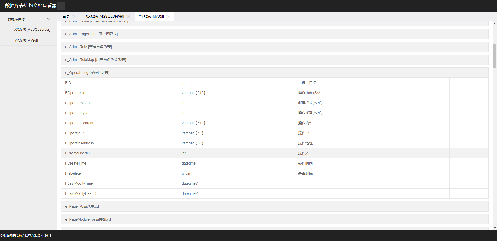

# CML.SqlDoc
CML.SqlDoc 是基于netcore2.1开发的数据库表结构文档查看器，通过简单的配置部署即使用，
数据库表结构文档查看器支持MSSql MySql多数据库 

## 界面呈现

## 如何部署
  *appsettings.json 数据库连接以及库名写入配置文件 格式如下
```javascript
 {
  "ConnectionStrings": {
    "SqlDoc.Reader": {
      "ConnectionString": "Min Pool Size=10;Max Pool Size=500;Connection Timeout=50;Data Source=127.0.0.1;Initial Catalog=Demo;Persist Security Info=True;User ID=sa;Password=123123",
      "providerName": "System.Data.SqlClient"
    },
    "SqlDoc.Writer": {
      "ConnectionString": "Min Pool Size=10;Max Pool Size=500;Connection Timeout=50;Data Source=127.0.0.1;Initial Catalog=Demo;Persist Security Info=True;User ID=sa;Password=123123",
      "providerName": "System.Data.SqlClient"
    }
  },
  "DataBaseConfig": [
    {
      "Id": "1",
      "Title": "XX系统",
      "DbName": "DBName2",
      "ConnectionString": "Min Pool Size=10;Max Pool Size=500;Connection Timeout=50;Data Source=xxxx;Initial Catalog=xxxx;Persist Security Info=True;User ID=xxxx;Password=xxxxx!",
      "DbType": "MSSQLServer"
    },
    {
      "Id": "2",
      "Title": "YY系统",
      "DbName": "DbName1",
      "ConnectionString": "Server=xxxxxx;Port=3306;Database=bt_hyaline;Uid=xxxx;Pwd=xxxxx;Charset=utf8;",
      "DbType": "MySql"
    }
  ]
}
```


## 技术栈

`core 2.1`

* 基于.Net Core 2.1开发；

* 前后端完全分离。`我们不限制规则，只用主流的技术构建强大的框架`；

* 前端采用 jquery + layui 

* 后端采用 asp.net mvc core 2.1  + Dapper + autofac 

## 补充

 项目引用CML.Lib CML.DataAccess 两个包已发布至nuget，源码请见 [git]https://github.com/willianchen/CML.NetCore


##有问题反馈
在使用中有任何问题，欢迎反馈给我，可以用以下联系方式跟我交流

* 邮件(willianli#126.com, 把#换成@)
* QQ: 474852546
